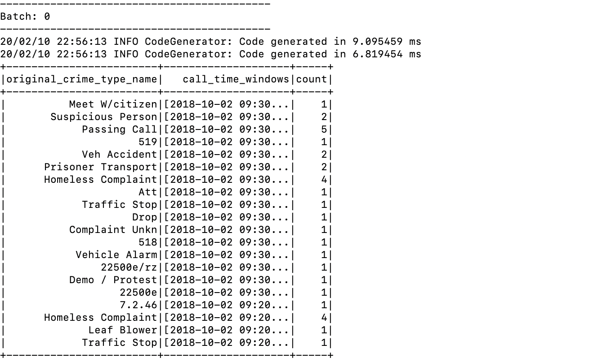

# Kafka Spark streaming integeration mini project.

---
In this project I developed kafka broker linked with spark streaming application in standalone cluster.

This application works with following flow. 

* Simulate transportation from excel file and send its to kafka through kafka producers. 
* Send data to kafka broker from postgresql DB through kafka connect. 
* Simulate weather data from excel file and send data to kafka broker through kafka rest proxy. 
* Transform turnstile data produced from first step and calculate total num entries data from ksql. 
* Transform data produced from postgresql database inside faust stream application and saved it in newly created topic. 

Execution.
---
* This app developed within docker environments you can test and run kafka files from docker environments 

* This app can be run through following steps. 
    * (1) execute Kafka Producer, rest-proxy call and kafka-connect script with `docker-compose exec kafkapython python kafka_server.py`
    * (2) running spark streaming application in following code `docker-compose exec spark spark-submit --packages org.apache.spark:spark-sql-kafka-0-10_2.11:2.4.4 --master spark://spark-master:7077 --deploy-mode client --driver-memory 4g --executor-memory 4g --executor-cores 1 data_stream.py`
        - You can change memory and core settings depending on your environments

Screenshots
---
*  Message read from kafka console

*  Spark Streaming execution from first batch.

*  Spark Streaming execution from later batch.

*  Spark query report .

Research&Insights
---
* How did changing values on the SparkSession property parameters affect the throughput and latency of the data?
    * We could tune sparksession property to increase throughput(which indicated as inputRowsPerSecond on reports) or calculation speed of whole data(ProcessedRowsPerSecond). 

* What were the 2-3 most efficient SparkSession property key/value pairs? Through testing multiple variations on values, how can you tell these were the most optimal?
    * spark.default.parallelism: Since default spark settings are limited to small number you can increase app spead by increasing this speed based on data structure. 
    * spark.memory.fraction: Increase this number also boosted app performance but it could lead to instability if the size of data getting bigger.  
    